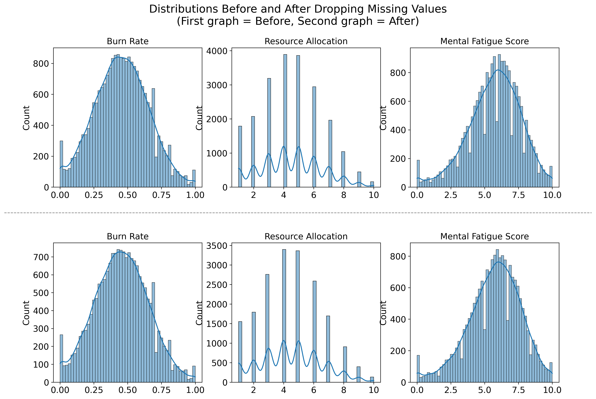
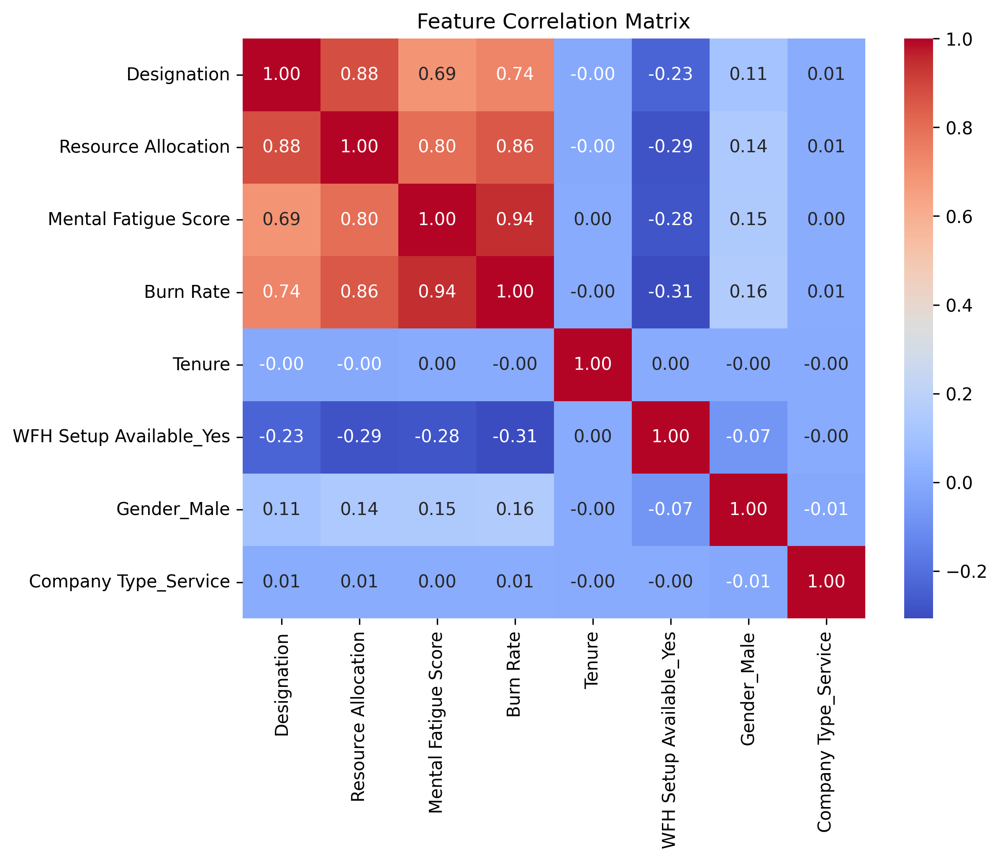
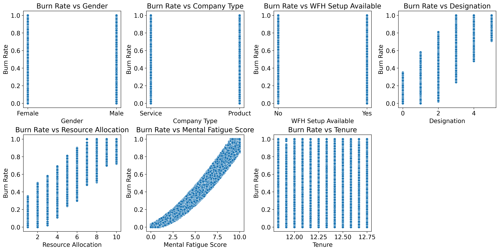
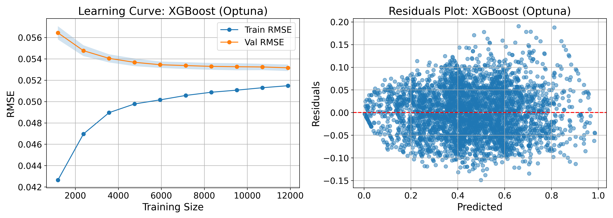
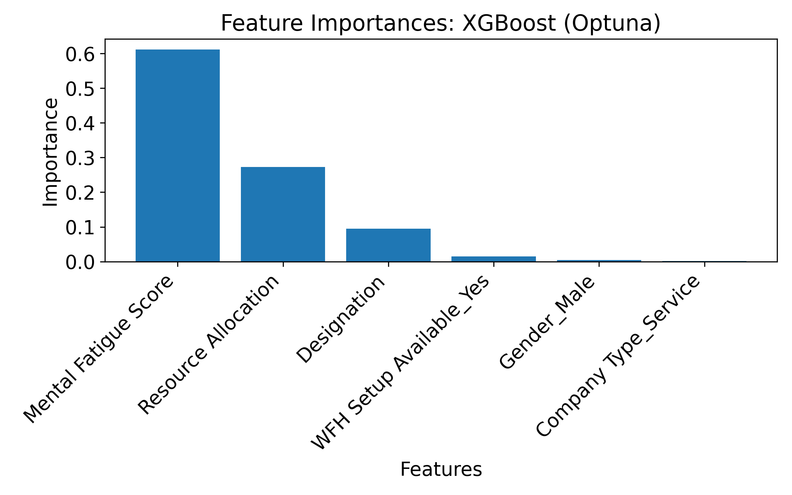

# Burnout Prediction with Machine Learning: A Model Comparison Framework

## Description
A comparative machine learning framework for predicting employee burnout, built and tuned on a public 18,590-observation dataset across seven regression algorithms (Linear Regression, Lasso, Random Forest, XGBoost, MLP, SVR, and a Voting Regressor). The best-performing model (XGBoost, hyperparameter-optimized with Optuna) is then tested on new data generated from a custom occupational well-being questionnaire.

## Overview

This repository contains the machine learning component of my MSc dissertation, *"Detecting Burnout Through AI & Enhancing Work-Life Balance"* (Data Analytics for Economics & Finance, University of Glasgow). It covers the model development and evaluation stage of the project: training, tuning, and comparing multiple regression algorithms to predict employee burnout, and testing the best model on new, unseen data.

The explanatory/HR analysis conducted on real company survey data is **not included** in this repository, as it falls outside the scope of the modeling pipeline shared here and involves confidential organizational data.

## Data

- **Training data**: A public dataset ([HackerEarth, 2020](https://www.kaggle.com/datasets/blurredmachine/are-your-employees-burning-out)) of employee records, including features such as designation, resource allocation, mental fatigue score, WFH availability, gender, and company type, with *Burn Rate* as the continuous target variable (0–1 scale). After removing missing values, the dataset used for training/validation/testing consisted of 18,590 observations.
- **New data (privacy-safeguarded)**: To evaluate how the tuned model generalizes to unseen, differently-sourced data, I designed a custom occupational well-being questionnaire, covering burnout (via the Maslach Burnout Inventory - General Survey), mental fatigue (inspired by the Occupational Fatigue Exhaustion Recovery scale), and eleven workplace/demographic predictors, structured to align with the schema of the training dataset. **The data used in this repository to test the model is randomly generated and does not contain any real employee responses.** This was done deliberately to protect the privacy of the individuals who completed the original questionnaire, while still demonstrating the full end-to-end prediction pipeline on new, out-of-distribution data.

## Repository Structure

| Notebook | Description |
|---|---|
| `1_Train_Dataset_Preparation.ipynb` | Loads the public burnout dataset, handles missing values, explores feature distributions and correlations, engineers the tenure feature, one-hot encodes categorical variables, and exports the cleaned dataset for training. |
| `2_Tuned_XGBoost_New_Data.ipynb` | Loads the prepared training data and the (randomly generated) new dataset built from the questionnaire schema, aligns their feature columns, and evaluates both the default-tuned and Optuna-tuned XGBoost models on this new data. |
| `3_Training_Model_Comparison.ipynb` | Trains and validates seven regression models (Linear Regression, Lasso, Random Forest, XGBoost, MLP, SVR, Voting Regressor) using nested cross-validation, statistically compares their performance, and further tunes the best model (XGBoost) using Optuna. Includes learning curve, residuals, and feature importance analysis. |

## Methodology Summary

1. **Preprocessing**: Missing values dropped (distributions unaffected — see below), categorical variables one-hot encoded, uninformative features (e.g., tenure) removed based on correlation analysis.

   

   The correlation matrix below guided feature selection: *Burn Rate* correlates strongly with *Mental Fatigue Score* (0.94), *Resource Allocation* (0.86), and *Designation* (0.74), while *Tenure* showed near-zero correlation with all other features and was dropped.

   

   Scatterplots against the target variable further confirmed these relationships, with Mental Fatigue Score showing the clearest non-linear association with Burn Rate.

   

2. **Model comparison**: Seven regression models trained and validated via nested cross-validation (5 outer × 3 inner folds), evaluated using MAE, RMSE, and R², with paired statistical tests to confirm meaningful performance differences.
3. **Hyperparameter tuning**: The best model, XGBoost, further optimized using Optuna's Tree-structured Parzen Estimator sampler across 100 trials.
4. **Out-of-sample testing**: The tuned XGBoost model evaluated on a held-out test split of the public dataset, alongside diagnostic learning curve, residual, and feature importance plots.

   

   

5. **Generalization test on new data**: Both the default-tuned and Optuna-tuned XGBoost models applied to a new dataset built from questionnaire-based data (randomly generated for this repository), aligned in structure to the original training features.

## Key Results

- **XGBoost** was the best-performing model on the public dataset's validation and test splits (Test R² ≈ 0.928, MAE ≈ 0.043), closely followed by the Random Forest. On this held-out test set, the Optuna-tuned version performed on par with the originally grid-searched XGBoost, with no statistically significant difference between the two.
- **Mental Fatigue Score** was by far the most influential predictor of burnout (~60% feature importance), followed by Resource Allocation (~25%) and Designation (~10%).
- On the new questionnaire-based data, the **Optuna-tuned XGBoost outperformed the non-tuned version** (MAE 0.082 vs. 0.084, RMSE 0.103 vs. 0.105, R² 0.726 vs. 0.716), suggesting its tuned hyperparameters generalized somewhat better to this new, differently-sourced data.
- Statistical testing confirmed XGBoost's advantage over most competing models, with no significant difference from Random Forest in MAE.

## Tools & Libraries

`Python`, `pandas`, `numpy`, `scikit-learn`, `XGBoost`, `Optuna`, `matplotlib`, `seaborn`

## Disclaimer

The data used to test the tuned XGBoost model in `2_Tuned_XGBoost_New_Data.ipynb` is **synthetically/randomly generated** and does not represent real individuals or actual company responses. This substitution was made specifically to preserve the confidentiality of the survey respondents from the original study while still showcasing the model's application to new data.
